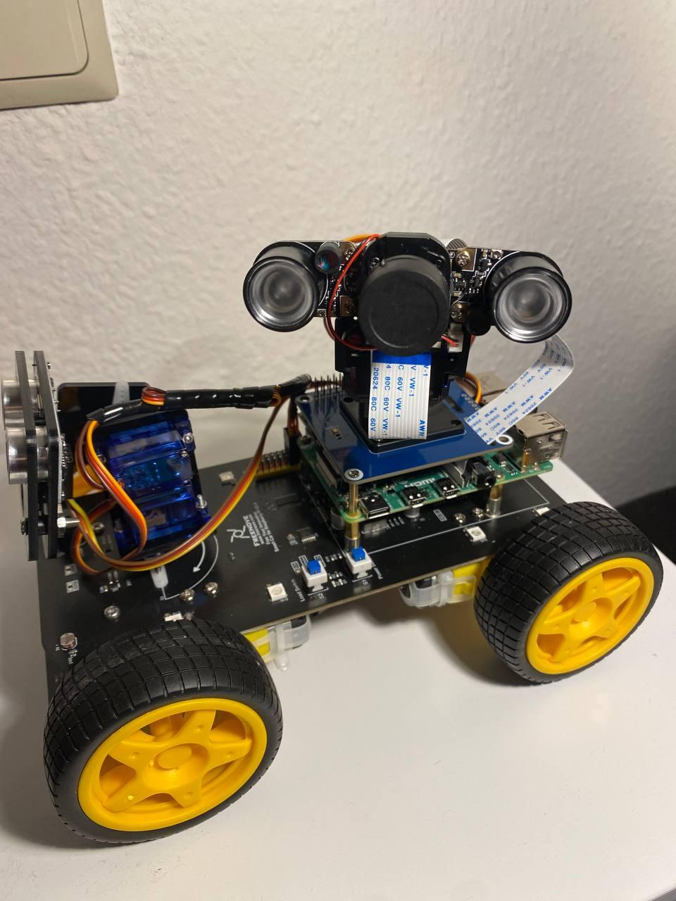

# Pan Tilt Camera experiment

I've attached a separate camera using Pan Tilt HAT (keeping original details untouched):

- https://www.waveshare.com/rpi-ir-cut-camera.htm
- https://www.waveshare.com/wiki/Pan-Tilt_HAT

In this experiment, I'm playing with idea of having dedicated surveillance camera. Original python scripts use a naive approach of streaming video which provides not the best video quality. So I decided to use RPi Cam Web Interface for it:

- https://elinux.org/RPi-Cam-Web-Interface

It seems a bit more mature and provides much more capabilities.

The scripts in this repo are original from Pan Tilt HAT + modifications to use streaming from RPi Cam Web Interface (no code style changes).

## How to use

- install dependencies according to the documentation
- run streaming server on 8088 (if a different port is used, adjust `index.html`)
- run servo server: `sudo python main.py`